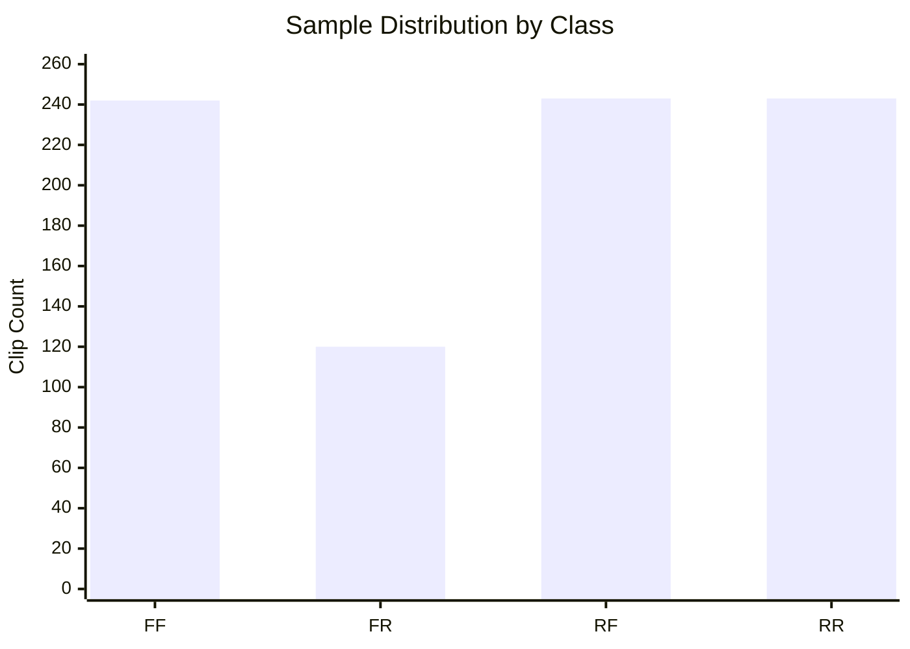
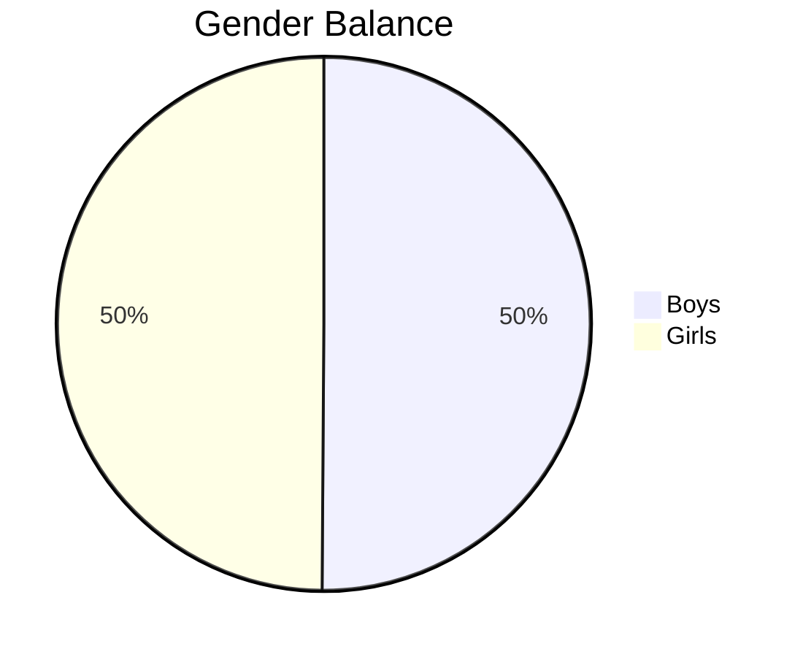
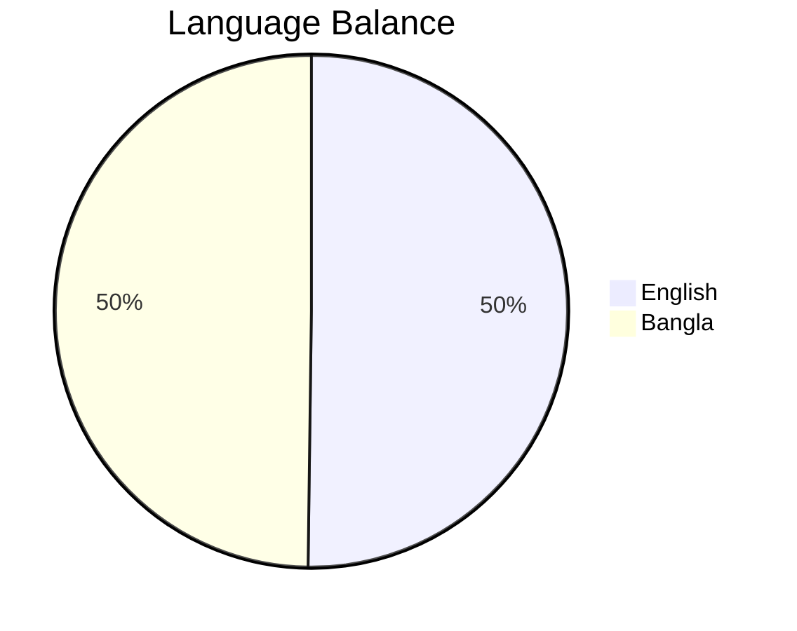
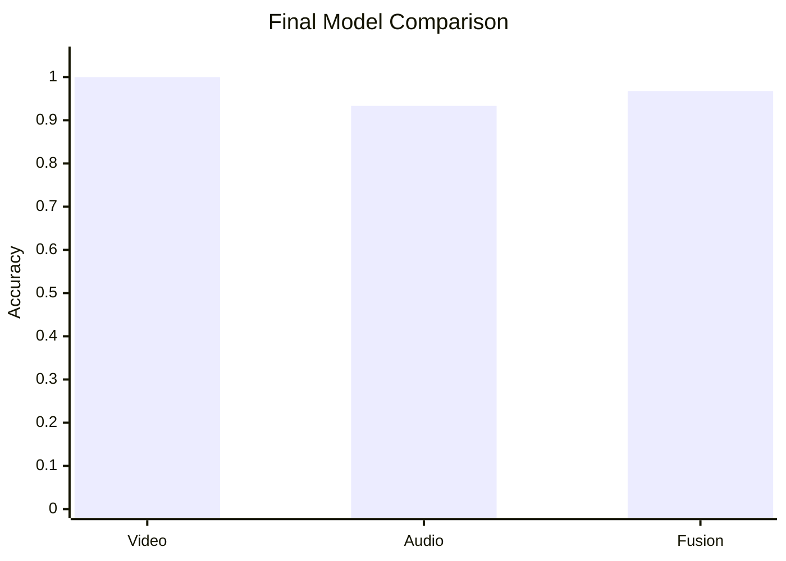

<<<<<<< HEAD
# Total Kaggle Training Report

## Executive Summary

The Kaggle run completed successfully on the 970-clip balanced subset and produced strong multimodal results. The video branch reached perfect validation accuracy, the audio branch stayed strong, and the final fusion model achieved 96.77% test accuracy with a 96.77% macro F1 score.

### Key Outcomes

| Item | Result |
| --- | ---: |
| Sampled clips | 970 |
| Unique folders | 240 |
| Train / Val / Test | 726 / 120 / 124 |
| Video best val accuracy | 1.0000 |
| Audio best val accuracy | 0.9333 |
| Fusion test accuracy | 0.9677 |
| Fusion macro F1 | 0.9677 |

### Model Stack

- Video backbone: ConvNeXt-Tiny
- Audio backbone: Wav2Vec2-Base
- Fusion model: two-head multimodal classifier with 4-class output

## Run Overview

This report summarizes the full Kaggle training pipeline stored in `Outputs/all_deepfake_outputs_new`.

## Sampled Data Summary

The sampled subset is well distributed across gender, language, and class labels.

| Split Dimension | Count |
| --- | ---: |
| Boys | 486 |
| Girls | 484 |
| English | 487 |
| Bangla | 483 |
| RR | 243 |
| RF | 243 |
| FF | 242 |
| FR | 120 |

The sample manifest is stored at `Outputs/all_deepfake_outputs_new/metadata/sample_manifest.json`.

### Distribution View

## Model Results

### Video Trainer

| Metric | Value |
| --- | ---: |
| Best validation accuracy | 1.0000 |
| Training samples | 726 |
| Validation samples | 120 |
| Test samples | 124 |
| Best checkpoint | `Outputs/all_deepfake_outputs_new/outputs/convnext_tiny_deepfake_best.pt` |

### Audio Trainer

| Metric | Value |
| --- | ---: |
| Best validation accuracy | 0.9333 |
| Training samples | 726 |
| Validation samples | 120 |
| Test samples | 124 |
| Best checkpoint | `Outputs/all_deepfake_outputs_new/outputs_audio/wav2vec2_base_deepfake_best.pt` |

### Fusion Trainer

| Metric | Value |
| --- | ---: |
| Test loss | 0.3365 |
| Video head accuracy | 0.9839 |
| Audio head accuracy | 0.9677 |
| Four-class accuracy | 0.9677 |
| Four-class macro F1 | 0.9677 |
| Best validation macro F1 | 1.0000 |
| Best epoch | 11 |
| Class names | FF, FR, RF, RR |

Fusion test confusion matrix:

| Actual \ Predicted | FF | FR | RF | RR |
| --- | ---: | ---: | ---: | ---: |
| FF | 28 | 1 | 2 | 0 |
| FR | 0 | 31 | 0 | 0 |
| RF | 0 | 0 | 31 | 0 |
| RR | 0 | 0 | 1 | 30 |

Fusion metrics are stored in `Outputs/all_deepfake_outputs_new/outputs_fusion_two_head/test_metrics.json`.

## Saved Artifacts

The Kaggle run produced the following main artifacts:

- `Outputs/all_deepfake_outputs_new/outputs/convnext_tiny_deepfake_best.pt`
- `Outputs/all_deepfake_outputs_new/outputs/metrics.pt`
- `Outputs/all_deepfake_outputs_new/outputs/train_embeddings.pt`
- `Outputs/all_deepfake_outputs_new/outputs/val_embeddings.pt`
- `Outputs/all_deepfake_outputs_new/outputs/test_embeddings.pt`
- `Outputs/all_deepfake_outputs_new/outputs_audio/wav2vec2_base_deepfake_best.pt`
- `Outputs/all_deepfake_outputs_new/outputs_audio/metrics.pt`
- `Outputs/all_deepfake_outputs_new/outputs_audio/train_embeddings.pt`
- `Outputs/all_deepfake_outputs_new/outputs_audio/val_embeddings.pt`
- `Outputs/all_deepfake_outputs_new/outputs_audio/test_embeddings.pt`
- `Outputs/all_deepfake_outputs_new/outputs_fusion_two_head/best_checkpoint.pt`
- `Outputs/all_deepfake_outputs_new/outputs_fusion_two_head/last_checkpoint.pt`
- `Outputs/all_deepfake_outputs_new/outputs_fusion_two_head/test_metrics.json`
- `Outputs/all_deepfake_outputs_new/outputs_fusion_two_head/test_metrics.pt`

## Interpretation

The run is strong overall. The video branch reached perfect validation accuracy on the held-out split, the audio branch also performed well, and the multimodal fusion model achieved 96.77% test accuracy with a macro F1 of 96.77%.

The remaining errors are concentrated in the FF class, where a few samples were confused with FR or RF. That means the model is already separating the four classes well, but it still benefits from a small amount of extra robustness on the hardest fake-video cases.

## Recommended Next Step

If you want to push the result further, the most direct improvements are:

1. Unfreeze more ConvNeXt blocks for the video branch.
2. Increase the number of sampled frames per clip.
3. Try a stronger temporal video encoder or a small temporal attention block before fusion.
4. Run a second Kaggle sweep with a slightly higher learning-rate search range.
=======
# Total Kaggle Training Report

## Executive Summary

The Kaggle run completed successfully on the 970-clip balanced subset and produced strong multimodal results. The video branch reached perfect validation accuracy, the audio branch stayed strong, and the final fusion model achieved 96.77% test accuracy with a 96.77% macro F1 score.

### Key Outcomes

| Item | Result |
| --- | ---: |
| Sampled clips | 970 |
| Unique folders | 240 |
| Train / Val / Test | 726 / 120 / 124 |
| Video best val accuracy | 1.0000 |
| Audio best val accuracy | 0.9333 |
| Fusion test accuracy | 0.9677 |
| Fusion macro F1 | 0.9677 |

### Model Stack

- Video backbone: ConvNeXt-Tiny
- Audio backbone: Wav2Vec2-Base
- Fusion model: two-head multimodal classifier with 4-class output

## Run Overview

This report summarizes the full Kaggle training pipeline stored in `Outputs/all_deepfake_outputs_new`.

## Sampled Data Summary

The sampled subset is well distributed across gender, language, and class labels.

| Split Dimension | Count |
| --- | ---: |
| Boys | 486 |
| Girls | 484 |
| English | 487 |
| Bangla | 483 |
| RR | 243 |
| RF | 243 |
| FF | 242 |
| FR | 120 |

The sample manifest is stored at `Outputs/all_deepfake_outputs_new/metadata/sample_manifest.json`.

### Distribution View

## Model Results

### Video Trainer

| Metric | Value |
| --- | ---: |
| Best validation accuracy | 1.0000 |
| Training samples | 726 |
| Validation samples | 120 |
| Test samples | 124 |
| Best checkpoint | `Outputs/all_deepfake_outputs_new/outputs/convnext_tiny_deepfake_best.pt` |

### Audio Trainer

| Metric | Value |
| --- | ---: |
| Best validation accuracy | 0.9333 |
| Training samples | 726 |
| Validation samples | 120 |
| Test samples | 124 |
| Best checkpoint | `Outputs/all_deepfake_outputs_new/outputs_audio/wav2vec2_base_deepfake_best.pt` |

### Fusion Trainer

| Metric | Value |
| --- | ---: |
| Test loss | 0.3365 |
| Video head accuracy | 0.9839 |
| Audio head accuracy | 0.9677 |
| Four-class accuracy | 0.9677 |
| Four-class macro F1 | 0.9677 |
| Best validation macro F1 | 1.0000 |
| Best epoch | 11 |
| Class names | FF, FR, RF, RR |

Fusion test confusion matrix:

| Actual \ Predicted | FF | FR | RF | RR |
| --- | ---: | ---: | ---: | ---: |
| FF | 28 | 1 | 2 | 0 |
| FR | 0 | 31 | 0 | 0 |
| RF | 0 | 0 | 31 | 0 |
| RR | 0 | 0 | 1 | 30 |

Fusion metrics are stored in `Outputs/all_deepfake_outputs_new/outputs_fusion_two_head/test_metrics.json`.

## Saved Artifacts

The Kaggle run produced the following main artifacts:

- `Outputs/all_deepfake_outputs_new/outputs/convnext_tiny_deepfake_best.pt`
- `Outputs/all_deepfake_outputs_new/outputs/metrics.pt`
- `Outputs/all_deepfake_outputs_new/outputs/train_embeddings.pt`
- `Outputs/all_deepfake_outputs_new/outputs/val_embeddings.pt`
- `Outputs/all_deepfake_outputs_new/outputs/test_embeddings.pt`
- `Outputs/all_deepfake_outputs_new/outputs_audio/wav2vec2_base_deepfake_best.pt`
- `Outputs/all_deepfake_outputs_new/outputs_audio/metrics.pt`
- `Outputs/all_deepfake_outputs_new/outputs_audio/train_embeddings.pt`
- `Outputs/all_deepfake_outputs_new/outputs_audio/val_embeddings.pt`
- `Outputs/all_deepfake_outputs_new/outputs_audio/test_embeddings.pt`
- `Outputs/all_deepfake_outputs_new/outputs_fusion_two_head/best_checkpoint.pt`
- `Outputs/all_deepfake_outputs_new/outputs_fusion_two_head/last_checkpoint.pt`
- `Outputs/all_deepfake_outputs_new/outputs_fusion_two_head/test_metrics.json`
- `Outputs/all_deepfake_outputs_new/outputs_fusion_two_head/test_metrics.pt`

## Interpretation

The run is strong overall. The video branch reached perfect validation accuracy on the held-out split, the audio branch also performed well, and the multimodal fusion model achieved 96.77% test accuracy with a macro F1 of 96.77%.

The remaining errors are concentrated in the FF class, where a few samples were confused with FR or RF. That means the model is already separating the four classes well, but it still benefits from a small amount of extra robustness on the hardest fake-video cases.

## Recommended Next Step

If you want to push the result further, the most direct improvements are:

1. Unfreeze more ConvNeXt blocks for the video branch.
2. Increase the number of sampled frames per clip.
3. Try a stronger temporal video encoder or a small temporal attention block before fusion.
4. Run a second Kaggle sweep with a slightly higher learning-rate search range.
>>>>>>> 23fb12c4f880a1cb7b5f20ebdfe4de8270de0e6b
